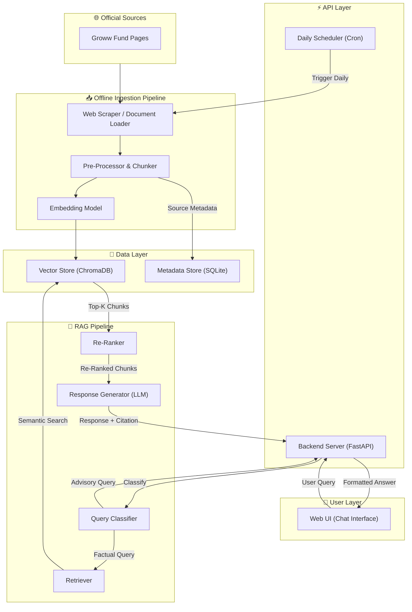
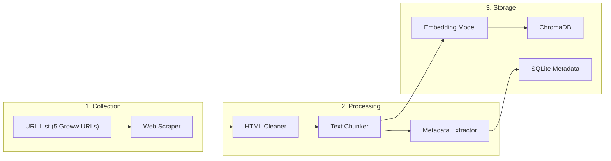
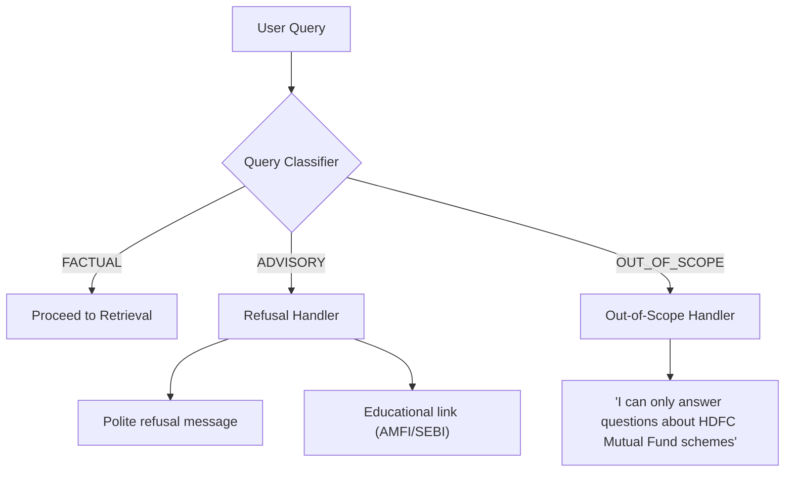
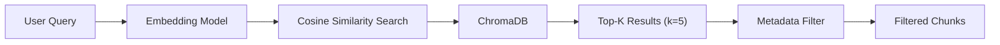
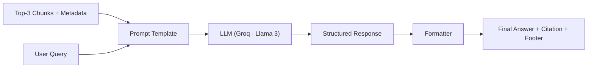
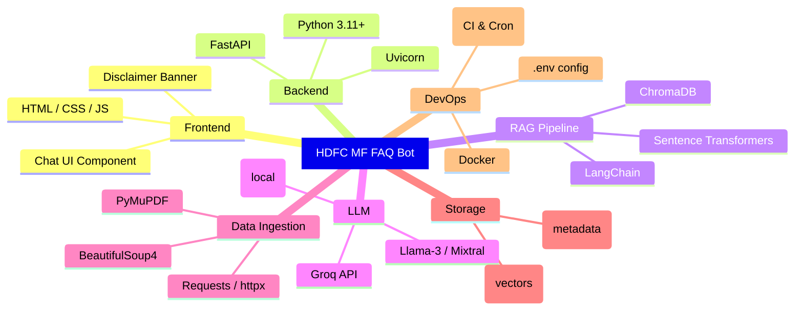
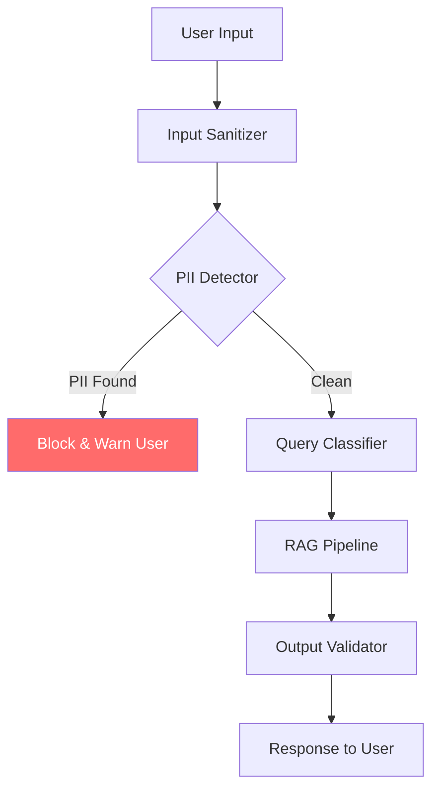
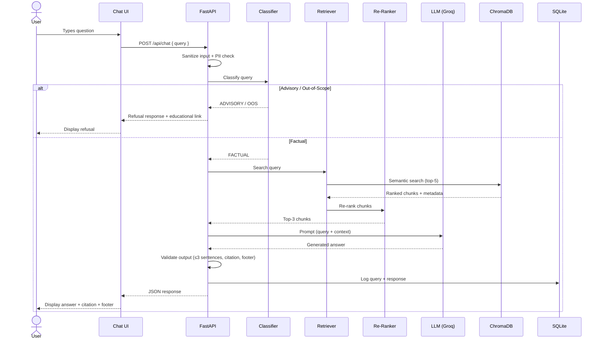
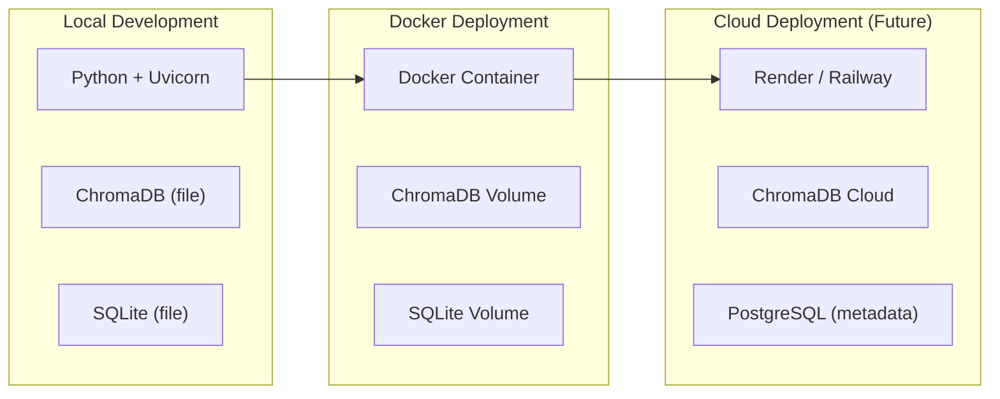

# Architecture: HDFC Mutual Fund FAQ Assistant (RAG Chatbot)

> This document describes the end-to-end system architecture for the facts-only mutual fund FAQ assistant built using Retrieval-Augmented Generation (RAG).

---

## 1. High-Level System Overview



### Flow Summary

1. **User** submits a question via the chat UI
2. **Query Classifier** determines if the query is factual or advisory
3. If **advisory** → return a polite refusal with an educational link
4. If **factual** → **Retriever** performs semantic search against the vector store
5. **Re-Ranker** scores and filters the top-K retrieved chunks
6. **Response Generator** (LLM) synthesizes a ≤3-sentence answer grounded in the retrieved context
7. Response is returned with exactly **one citation link** and a **"Last updated"** footer

---

## 2. Component Architecture

### 2.1 Data Ingestion Pipeline (Offline)

This pipeline runs **offline/on-demand** to build and refresh the knowledge base.



#### Source URLs Breakdown

| Source Type | Count | Examples |
|---|---|---|
| Groww Fund Pages | 5 | Scheme pages for all 5 HDFC funds |
| **Total** | **5** | |

#### Chunking Strategy

The scraped Groww pages produce structured, line-by-line key-value data (not flowing paragraphs). A **section-aware chunking** strategy is used to preserve semantic boundaries.

| Parameter | Value | Rationale |
|---|---|---|
| Strategy | Section-aware splitting (custom) | Preserves semantic boundaries (fund overview vs. exit load vs. holdings) |
| Max Chunk Size | 800 characters | Each "section" is a self-contained fact cluster; larger size preserves context |
| Chunk Overlap | 50 characters | Only applied when oversized sections are split further |
| Fallback Splitter | `RecursiveCharacterTextSplitter` | Used within large sections like Holdings |
| Metadata per Chunk | `source_url`, `scheme_name`, `category`, `document_type`, `section`, `scraped_date` | Enables filtered retrieval, citation, and section-level search |

---

### 2.2 Query Classifier

The query classifier is the **first gate** in the pipeline. It determines whether a user's question is factual or advisory before any retrieval happens.



#### Classification Categories

| Category | Description | Example Queries |
|---|---|---|
| `FACTUAL` | Objective, verifiable questions about fund attributes | "What is the expense ratio of HDFC Large Cap Fund?" |
| `ADVISORY` | Queries seeking investment advice, opinions, or comparisons | "Should I invest in HDFC Small Cap?", "Which fund is better?" |
| `OUT_OF_SCOPE` | Queries unrelated to the 5 HDFC schemes | "What is Nifty 50?", "Tell me about SBI Mutual Funds" |

#### Implementation Approach

- **Primary:** LLM-based classification via a system prompt with few-shot examples
- **Fallback:** Keyword-based heuristic (regex patterns for advisory terms like "should", "better", "recommend", "suggest")

---

### 2.3 Retriever

The retriever performs **semantic search** to find the most relevant chunks from the vector store.



| Parameter | Value |
|---|---|
| Embedding Model | `BAAI/bge-small-en-v1.5` (via sentence-transformers) |
| Vector Store | ChromaDB (persistent, file-based) |
| Top-K | 5 |
| Similarity Metric | Cosine Similarity |
| Metadata Filtering | Optional filter by `scheme_name` or `document_type` if detected in query |

#### Scheme Detection

Before retrieval, a lightweight **entity extractor** identifies if the user mentioned a specific scheme:

| User Says | Detected Scheme |
|---|---|
| "HDFC Large Cap" / "large cap fund" | `HDFC Large Cap Fund` |
| "gold fund" / "gold ETF" | `HDFC Gold ETF Fund of Fund` |
| "silver" / "silver ETF" | `HDFC Silver ETF Fund of Fund` |
| "mid cap" / "midcap" | `HDFC Mid-Cap Opportunities Fund` |
| "small cap" / "smallcap" | `HDFC Small Cap Fund` |

When a scheme is detected, the retriever applies a **metadata filter** to narrow results, improving precision.

---

### 2.4 Re-Ranker (Optional but Recommended)

A cross-encoder re-ranker scores query-chunk pairs for improved relevance after the initial retrieval.

| Parameter | Value |
|---|---|
| Model | `BAAI/bge-reranker-base` |
| Input | Top-5 chunks from retriever |
| Output | Top-3 re-ranked chunks |
| Threshold | Discard chunks with score < 0.3 |

> [!NOTE]
> The re-ranker is optional for the MVP. It can be added later to improve answer quality without changing the overall architecture.

---

### 2.5 Response Generator (LLM)

The generator synthesizes a grounded answer using the retrieved context and a carefully crafted system prompt.



#### LLM Selection

| Option | Model | Cost | Latency | Recommended For |
|---|---|---|---|---|
| **Primary** | Groq (`llama3-8b-8192`) | Free/Low | ~0.5s | Ultra-low latency generation |
| Alternative | Groq (`mixtral-8x7b-32768`) | Free/Low | ~0.7s | Better reasoning capabilities |
| Local / Free | `llama-3-8b` via Ollama | Free | ~3–5s | Offline development and testing |

#### System Prompt Design

```text
You are a facts-only mutual fund assistant for HDFC Mutual Fund schemes.

RULES:
1. Answer ONLY using the provided context. Do NOT use prior knowledge.
2. Keep responses to a MAXIMUM of 3 sentences.
3. Include EXACTLY ONE source citation link from the context metadata.
4. End every response with: "Last updated from sources: <date>"
5. If the context does not contain the answer, say:
   "I don't have this information in my current sources. Please check [source_link]."
6. NEVER provide investment advice, opinions, or recommendations.
7. NEVER compare fund performance or calculate returns.
8. For performance queries, respond ONLY with a link to the official factsheet.

CONTEXT:
{retrieved_chunks}

SOURCE METADATA:
{chunk_metadata}

USER QUERY:
{user_query}
```

#### Response Format

```json
{
  "answer": "The expense ratio of HDFC Large Cap Fund (Direct Plan) is 1.04% as of the latest factsheet.",
  "citation": "https://www.hdfcfund.com/mutual-fund/equity/hdfc-large-cap-fund",
  "last_updated": "2026-06-30",
  "query_type": "FACTUAL"
}
```

---

### 2.6 Refusal Handler

When the Query Classifier flags a query as `ADVISORY` or `OUT_OF_SCOPE`, the refusal handler generates a compliant response.

#### Refusal Templates

| Type | Response Template |
|---|---|
| `ADVISORY` | "I'm a facts-only assistant and cannot provide investment advice or recommendations. For investment guidance, please consult a SEBI-registered advisor. You may find this resource helpful: [AMFI Investor Education](https://www.amfiindia.com/investor-corner/knowledge-center.html)" |
| `OUT_OF_SCOPE` | "I can only answer factual questions about the following HDFC Mutual Fund schemes: Large Cap, Mid-Cap, Small Cap, Gold ETF FoF, and Silver ETF FoF. Please ask a question related to these schemes." |
| `PERFORMANCE_COMPARISON` | "I cannot compare fund performance or calculate returns. For the latest performance data, please refer to the official factsheet: [factsheet_link]" |

---

### 2.7 Automated Data Refresh (Scheduler)

To ensure the RAG knowledge base remains up to date with the latest Mutual Fund data (AUM, NAV, Holdings, etc.), a GitHub Actions cron job automatically triggers the ingestion pipeline daily and commits the updated vectorstore back to the repository.

| Parameter | Description |
|---|---|
| Platform | GitHub Actions |
| Frequency | Daily at 10:30 AM IST (cron: `0 5 * * *`) |
| Target | `scripts/ingest.py` `run_pipeline()` |
| Execution | Runs in an isolated runner on GitHub, keeping the API server unburdened. |

---

## 3. Data Model

### 3.1 Vector Store Schema (ChromaDB)

```text
Collection: "hdfc_mf_chunks"

Document:
  ├── id: string (UUID)
  ├── text: string (chunk content)
  ├── embedding: float[] (vector)
  └── metadata:
        ├── source_url: string
        ├── scheme_name: string
        ├── category: string ("Large Cap" | "Mid Cap" | "Small Cap" | "Gold ETF FoF" | "Silver ETF FoF")
        ├── document_type: string ("groww_page")
        ├── scraped_date: string (ISO 8601)
        └── chunk_index: int
```

### 3.2 Metadata Store Schema (SQLite)

```sql
-- Tracks all ingested source documents
CREATE TABLE sources (
    id            INTEGER PRIMARY KEY AUTOINCREMENT,
    url           TEXT NOT NULL UNIQUE,
    scheme_name   TEXT,
    document_type TEXT,
    scraped_date  TEXT NOT NULL,
    chunk_count   INTEGER,
    status        TEXT DEFAULT 'active'  -- 'active' | 'stale' | 'failed'
);

-- Logs all user interactions for analytics
CREATE TABLE query_logs (
    id            INTEGER PRIMARY KEY AUTOINCREMENT,
    timestamp     TEXT NOT NULL,
    user_query    TEXT NOT NULL,
    query_type    TEXT NOT NULL,   -- 'FACTUAL' | 'ADVISORY' | 'OUT_OF_SCOPE'
    response      TEXT,
    citation_url  TEXT,
    latency_ms    INTEGER
);
```

---

## 4. Tech Stack



### Detailed Stack Table

| Layer | Technology | Version | Purpose |
|---|---|---|---|
| **Frontend** | HTML + CSS + Vanilla JS | — | Minimal chat interface |
| **Backend** | FastAPI | ≥0.100 | REST API server |
| **Server** | Uvicorn | ≥0.27 | ASGI server for FastAPI |
| **Orchestration** | LangChain | ≥0.2 | RAG pipeline orchestration |
| **Embeddings** | sentence-transformers (`BAAI/bge-small-en-v1.5`) | ≥2.2 | Text → vector embeddings |
| **Vector Store** | ChromaDB | ≥0.4 | Persistent vector storage & similarity search |
| **LLM** | Groq (`llama3-8b-8192`) | — | Response generation |
| **Scraping** | BeautifulSoup4 + Requests | ≥4.12 | Web page scraping |
| **Scheduling**| GitHub Actions | — | Automated daily ingestion cron |
| **Metadata DB** | SQLite | Built-in | Source tracking & query logging |
| **Config** | python-dotenv | ≥1.0 | Environment variable management |
| **Containerization** | Docker | ≥24 | Reproducible deployments |

---

## 5. API Design

### 5.1 Endpoints

| Method | Endpoint | Description |
|---|---|---|
| `POST` | `/api/chat` | Submit a user query, receive a response |
| `GET` | `/api/health` | Health check |
| `GET` | `/api/schemes` | List available schemes |
| `POST` | `/api/ingest` | Trigger re-ingestion of sources (admin) |

### 5.2 Chat Endpoint — Request / Response

**Request:**
```json
POST /api/chat
Content-Type: application/json

{
  "query": "What is the expense ratio of HDFC Small Cap Fund?"
}
```

**Response (Factual):**
```json
{
  "status": "success",
  "query_type": "FACTUAL",
  "answer": "The expense ratio of HDFC Small Cap Fund (Direct Plan - Growth) is 0.73% (as per the latest monthly factsheet).",
  "citation": "https://www.hdfcfund.com/mutual-fund/equity/hdfc-small-cap-fund",
  "last_updated": "2026-06-30",
  "disclaimer": "Facts-only. No investment advice."
}
```

**Response (Advisory — Refused):**
```json
{
  "status": "refused",
  "query_type": "ADVISORY",
  "answer": "I'm a facts-only assistant and cannot provide investment advice. For guidance, please consult a SEBI-registered advisor.",
  "educational_link": "https://www.amfiindia.com/investor-corner/knowledge-center.html",
  "disclaimer": "Facts-only. No investment advice."
}
```

---

## 6. Project Structure

```
RAG-project/
├── problemStatement.md           # Problem definition
├── Architecture.md               # This document
├── README.md                     # Setup & usage guide
│
├── data/
│   ├── urls.json                 # Curated list of 5 Groww URLs
│   ├── raw/                      # Raw scraped HTML files
│   └── processed/                # Cleaned text files with metadata
│
├── src/
│   ├── ingestion/
│   │   ├── scraper.py            # Web scraping logic
│   │   ├── chunker.py            # Text splitting & chunking
│   │   └── embedder.py           # Embedding generation & ChromaDB upsert
│   │
│   ├── pipeline/
│   │   ├── classifier.py         # Query classification (factual / advisory / OOS)
│   │   ├── retriever.py          # Semantic search against ChromaDB
│   │   ├── reranker.py           # Cross-encoder re-ranking (optional)
│   │   └── generator.py          # LLM response generation
│   │
│   ├── api/
│   │   ├── main.py               # FastAPI app entry point
│   │   ├── routes.py             # API route definitions
│   │   └── models.py             # Pydantic request/response schemas
│   │
│   └── utils/
│       ├── config.py             # Environment & settings management
│       ├── prompts.py            # System prompt templates
│       └── metadata.py           # SQLite metadata operations
│
├── frontend/
│   ├── index.html                # Chat UI
│   ├── style.css                 # Styles
│   └── script.js                 # Chat logic & API calls
│
├── vectorstore/                  # ChromaDB persistent storage (gitignored)
├── db/
│   └── metadata.db               # SQLite database (gitignored)
│
├── tests/
│   ├── test_classifier.py        # Query classification tests
│   ├── test_retriever.py         # Retrieval accuracy tests
│   └── test_refusal.py           # Refusal handling tests
│
├── scripts/
│   └── ingest.py                 # CLI script to run ingestion pipeline
│
├── .env.example                  # Environment variable template
├── .gitignore
├── requirements.txt
└── Dockerfile
```

---

## 7. Security & Compliance Architecture



### Guards

| Guard | Layer | Purpose |
|---|---|---|
| **Input Sanitizer** | Pre-processing | Strip HTML, limit input length (500 chars), normalize whitespace |
| **PII Detector** | Pre-processing | Regex-based detection of PAN, Aadhaar, phone, email patterns → block query |
| **Query Classifier** | Classification | Reject advisory/out-of-scope queries before retrieval |
| **Output Validator** | Post-processing | Ensure response ≤3 sentences, has citation, has footer, no advisory language |
| **Rate Limiter** | API layer | 30 requests/minute per IP to prevent abuse |

---

## 8. Data Flow Summary



---

## 9. Deployment Architecture



| Environment | Stack | Notes |
|---|---|---|
| **Local Dev** | Uvicorn + ChromaDB (file) + SQLite | Default for development |
| **Docker** | Single container, mounted volumes | Reproducible, portable |
| **Cloud (Future)** | Render/Railway + ChromaDB Cloud + PostgreSQL | For production scale |

---

## 10. Performance Targets

| Metric | Target | Measurement |
|---|---|---|
| **Response Latency** | < 3 seconds (end-to-end) | From query submission to response render |
| **Retrieval Accuracy** | ≥ 85% (top-3 relevance) | Manual evaluation on 50 test queries |
| **Refusal Accuracy** | ≥ 95% | Advisory queries correctly refused |
| **Citation Accuracy** | 100% | Every factual response includes a valid source link |
| **Uptime** | ≥ 99% (in deployed environment) | Health check monitoring |

---

## 11. Known Limitations & Future Improvements

### Current Limitations

| Limitation | Impact | Mitigation |
|---|---|---|
| Static corpus (no live data) | Answers may be outdated | Include "Last updated" footer; schedule periodic re-ingestion |
| Limited to 5 HDFC schemes | Cannot answer about other AMCs/schemes | Clear out-of-scope messaging |
| No conversational memory | Each query is independent | Acceptable for FAQ use case |

### Future Improvements

- **Scheduled re-ingestion** via cron to keep corpus fresh
- **Conversational memory** for multi-turn follow-ups
- **Admin dashboard** with analytics on query volume, unanswered queries, and latency
- **Multi-AMC expansion** to cover more fund houses
- **Multilingual support** (Hindi, regional languages) for wider reach
