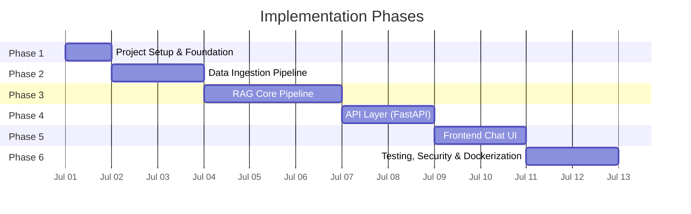
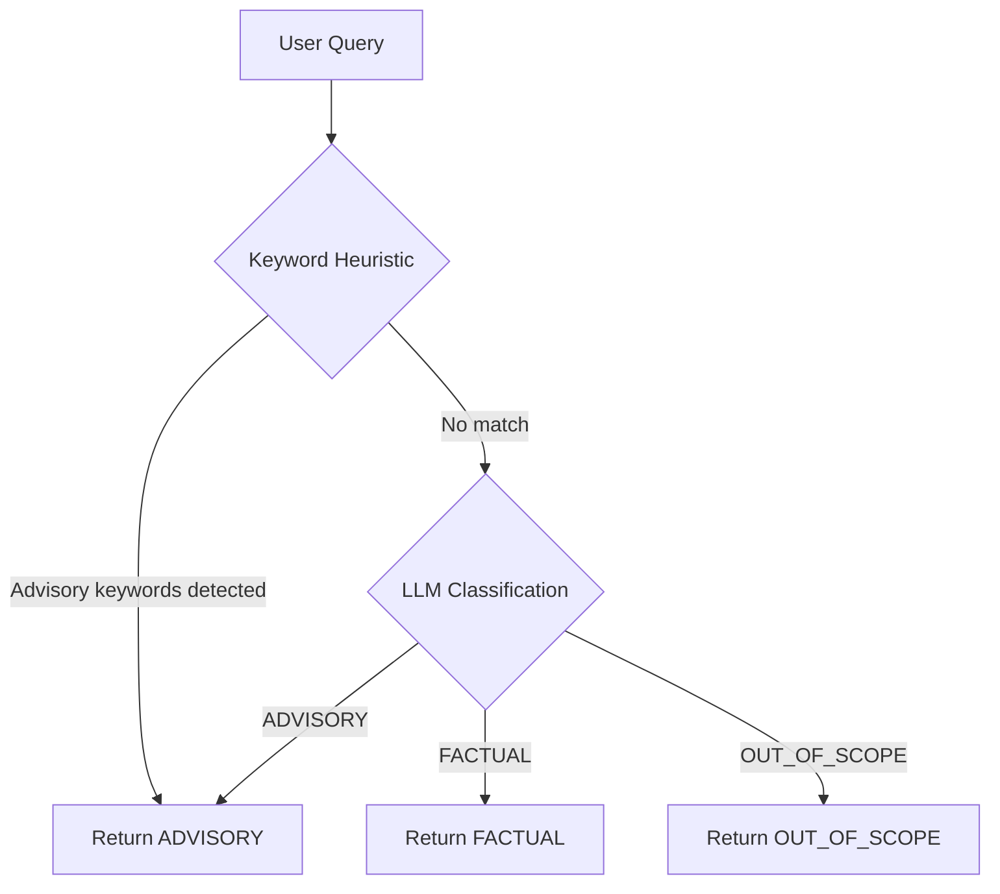
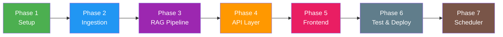

# Implementation Plan: HDFC Mutual Fund FAQ Assistant

> Phase-wise execution plan derived from [Architecture.md](file:///c:/Users/KIIT0001/Desktop/PM%20Projects/RAG-project/Architecture.md)

---

## Phase Overview



---

## Phase 1: Project Setup & Foundation

**Goal:** Establish the repository structure, install all dependencies, create configuration files, and initialize data stores.

### 1.1 Directory Structure

Create the full project scaffold as defined in the architecture:

```
RAG-project/
├── data/
│   ├── urls.json
│   ├── raw/
│   └── processed/
├── src/
│   ├── ingestion/
│   │   ├── __init__.py
│   │   ├── scraper.py
│   │   ├── chunker.py
│   │   └── embedder.py
│   ├── pipeline/
│   │   ├── __init__.py
│   │   ├── classifier.py
│   │   ├── retriever.py
│   │   ├── reranker.py
│   │   └── generator.py
│   ├── api/
│   │   ├── __init__.py
│   │   ├── main.py
│   │   ├── routes.py
│   │   └── models.py
│   └── utils/
│       ├── __init__.py
│       ├── config.py
│       ├── prompts.py
│       └── metadata.py
├── frontend/
│   ├── index.html
│   ├── style.css
│   └── script.js
├── vectorstore/
├── db/
├── tests/
│   ├── test_classifier.py
│   ├── test_retriever.py
│   └── test_refusal.py
├── scripts/
│   └── ingest.py
├── .env.example
├── .gitignore
├── requirements.txt
└── Dockerfile
```

### 1.2 Dependencies (`requirements.txt`)

```
fastapi>=0.100
uvicorn>=0.27
langchain>=0.2
langchain-community>=0.2
langchain-groq>=0.1
chromadb>=0.4
sentence-transformers>=2.2
beautifulsoup4>=4.12
requests>=2.31
python-dotenv>=1.0
pydantic>=2.0
```

### 1.3 Environment Config (`.env.example`)

```env
# LLM Provider
GROQ_API_KEY=gsk-your-key-here
# OR
GOOGLE_API_KEY=your-google-key-here

# LLM Model Selection
LLM_PROVIDER=groq            # groq | ollama
LLM_MODEL=llama3-8b-8192     # llama3-8b-8192 | mixtral-8x7b-32768

# Embedding
EMBEDDING_MODEL=BAAI/bge-small-en-v1.5

# ChromaDB
CHROMA_PERSIST_DIR=./vectorstore
CHROMA_COLLECTION=hdfc_mf_chunks

# SQLite
SQLITE_DB_PATH=./db/metadata.db
```

### 1.4 Source URLs (`data/urls.json`)

```json
{
  "sources": [
    {
      "url": "https://groww.in/mutual-funds/hdfc-large-cap-fund-direct-growth",
      "scheme_name": "HDFC Large Cap Fund",
      "category": "Large Cap"
    },
    {
      "url": "https://groww.in/mutual-funds/hdfc-mid-cap-fund-direct-growth",
      "scheme_name": "HDFC Mid-Cap Opportunities Fund",
      "category": "Mid Cap"
    },
    {
      "url": "https://groww.in/mutual-funds/hdfc-small-cap-fund-direct-growth",
      "scheme_name": "HDFC Small Cap Fund",
      "category": "Small Cap"
    },
    {
      "url": "https://groww.in/mutual-funds/hdfc-gold-etf-fund-of-fund-direct-plan-growth",
      "scheme_name": "HDFC Gold ETF Fund of Fund",
      "category": "Gold ETF FoF"
    },
    {
      "url": "https://groww.in/mutual-funds/hdfc-silver-etf-fof-direct-growth",
      "scheme_name": "HDFC Silver ETF Fund of Fund",
      "category": "Silver ETF FoF"
    }
  ]
}
```

### 1.5 SQLite Schema Initialization (`src/utils/metadata.py`)

Create the two tables as defined in the Architecture — `sources` and `query_logs`:

```sql
CREATE TABLE IF NOT EXISTS sources (
    id            INTEGER PRIMARY KEY AUTOINCREMENT,
    url           TEXT NOT NULL UNIQUE,
    scheme_name   TEXT,
    document_type TEXT,
    scraped_date  TEXT NOT NULL,
    chunk_count   INTEGER,
    status        TEXT DEFAULT 'active'
);

CREATE TABLE IF NOT EXISTS query_logs (
    id            INTEGER PRIMARY KEY AUTOINCREMENT,
    timestamp     TEXT NOT NULL,
    user_query    TEXT NOT NULL,
    query_type    TEXT NOT NULL,
    response      TEXT,
    citation_url  TEXT,
    latency_ms    INTEGER
);
```

### 1.6 `.gitignore`

```
.env
vectorstore/
db/metadata.db
__pycache__/
*.pyc
data/raw/
```

### Phase 1 Checklist

| # | Task | File(s) |
|---|---|---|
| 1 | Create all directories and `__init__.py` files | Project root |
| 2 | Write `requirements.txt` | `requirements.txt` |
| 3 | Create `.env.example` | `.env.example` |
| 4 | Create `.gitignore` | `.gitignore` |
| 5 | Write `data/urls.json` with 5 Groww URLs | `data/urls.json` |
| 6 | Implement `src/utils/config.py` (load `.env`, expose settings) | `src/utils/config.py` |
| 7 | Implement `src/utils/metadata.py` (SQLite init + CRUD) | `src/utils/metadata.py` |
| 8 | Install dependencies (`pip install -r requirements.txt`) | — |

---

## Phase 2: Data Ingestion Pipeline

**Goal:** Scrape the 5 Groww URLs, clean the HTML, chunk the text, generate embeddings, and store everything in ChromaDB + SQLite.

### 2.1 Web Scraper (`src/ingestion/scraper.py`)

| Step | Detail |
|---|---|
| Input | `data/urls.json` |
| HTTP Client | `requests` with proper `User-Agent` header |
| Parser | `BeautifulSoup4` with `html.parser` |
| Cleaning | Strip `<nav>`, `<footer>`, `<script>`, `<style>`, ads, sidebars |
| Extract | Main content area text (fund details, tables, key metrics) |
| Output | Save cleaned text to `data/raw/{scheme_slug}.txt` |

### 2.2 Text Chunker (`src/ingestion/chunker.py`)

#### Data Structure Analysis

The scraped Groww pages produce **structured, line-by-line key-value data** (not flowing paragraphs). Each file contains ~200–400 lines organized into distinct logical sections:

| Section | Line Range (approx.) | Content Type | FAQ Relevance |
|---|---|---|---|
| **Fund Overview** | 1–22 | NAV, SIP min, AUM, expense ratio, rating | ⭐ Very High |
| **Return Calculator** | 23–50 | SIP return tables (1Y, 3Y, 5Y, 10Y) | Medium |
| **Holdings** | 51–240 | Stock names + sectors + % allocation | Low–Medium |
| **Investment Minimums** | ~243–248 | Min SIP, 1st/2nd investment amounts | ⭐ High |
| **Returns & Rankings** | ~249–270 | Annualized returns, category rank | Medium |
| **Exit Load & Tax** | ~271–278 | Exit load %, stamp duty, LTCG/STCG tax | ⭐ Very High |
| **Fund Management** | ~302–360 | Fund manager bio, other schemes managed | Low |
| **About & Fund House** | ~362–398 | Scheme description, benchmark, AMC info | ⭐ High |

#### Chunking Strategy: Section-Aware Splitting

Instead of a generic `RecursiveCharacterTextSplitter`, we use a **two-pass approach**:

1. **Pass 1 — Section Detection:** Identify logical section boundaries using header keywords (`Holdings`, `Exit load`, `Return calculator`, `About`, `Fund management`, etc.).
2. **Pass 2 — Size-Bounded Splitting:** Within each section, apply `RecursiveCharacterTextSplitter` only if the section exceeds the max chunk size (e.g., the Holdings section).

| Parameter | Value | Rationale |
|---|---|---|
| Strategy | Section-aware splitting (custom) | Preserves semantic boundaries between fund overview, exit load, holdings, etc. |
| Max Chunk Size | 800 characters | Larger than default because each "section" is a self-contained fact cluster |
| Chunk Overlap | 50 characters | Only applied when a section is split further |
| Fallback Splitter | `RecursiveCharacterTextSplitter` | Used within oversized sections like Holdings |
| Section Headers | `Holdings`, `Exit load`, `Return calculator`, `Fund management`, `About`, `Returns and rankings`, `Min. for 1st investment` | Detected via keyword matching |

#### Section Header Keywords

```python
SECTION_HEADERS = [
    "Holdings",
    "Min. for 1st investment",
    "Returns and rankings",
    "Exit load, stamp duty and tax",
    "Compare similar funds",
    "Fund management",
    "About",
    "Fund house",
    "Return calculator",
]
```

Each chunk carries metadata:

```python
{
    "source_url": "https://groww.in/mutual-funds/hdfc-large-cap-fund-direct-growth",
    "scheme_name": "HDFC Large Cap Fund",
    "category": "Large Cap",
    "document_type": "groww_page",
    "section": "exit_load_tax",
    "scraped_date": "2026-07-01",
    "chunk_index": 0
}
```

### 2.3 Embedder & Vector Store (`src/ingestion/embedder.py`)

| Step | Detail |
|---|---|
| Model | `BAAI/bge-small-en-v1.5` (via `sentence-transformers`) |
| Model Rationale | The corpus consists of exactly 79 chunks, with a max size of 798 chars (~142 words). Since BGE-small supports up to 512 tokens (~380 words), every single chunk fits perfectly without truncation. A large model would consume more memory without providing any semantic benefit for these dense key-value pairs. |
| Vector DB | ChromaDB (persistent, `./vectorstore`) |
| Collection | `hdfc_mf_chunks` |
| Operation | Upsert chunks with embeddings + metadata |

### 2.4 Ingestion CLI Script (`scripts/ingest.py`)

A single entry-point script that chains: **scrape → chunk → embed → update SQLite**

```bash
python scripts/ingest.py
```

### Phase 2 Checklist

| # | Task | File(s) |
|---|---|---|
| 1 | Implement web scraper with HTML cleaning | `src/ingestion/scraper.py` |
| 2 | Implement text chunker with metadata attachment | `src/ingestion/chunker.py` |
| 3 | Implement embedding generation + ChromaDB upsert | `src/ingestion/embedder.py` |
| 4 | Create CLI ingestion script | `scripts/ingest.py` |
| 5 | Run ingestion and verify ChromaDB has chunks | — |
| 6 | Verify SQLite `sources` table is populated | — |

---

## Phase 3: RAG Core Pipeline

**Goal:** Build the query classifier, semantic retriever, and LLM response generator.

### 3.1 Query Classifier (`src/pipeline/classifier.py`)



**Keyword heuristic patterns (fallback):**

| Pattern | Classification |
|---|---|
| `should I`, `recommend`, `suggest`, `better`, `best`, `worth it` | `ADVISORY` |
| `compare`, `vs`, `versus`, `which is better` | `ADVISORY` (performance comparison) |

**LLM classification prompt (primary):**

```text
Classify the following user query into one of three categories:
- FACTUAL: Objective questions about HDFC mutual fund schemes (expense ratio, exit load, NAV, SIP amount, benchmark, riskometer, etc.)
- ADVISORY: Questions seeking investment advice, recommendations, opinions, or comparisons
- OUT_OF_SCOPE: Questions not related to the 5 HDFC schemes we support

Query: "{user_query}"

Respond with ONLY one word: FACTUAL, ADVISORY, or OUT_OF_SCOPE
```

### 3.2 Retriever (`src/pipeline/retriever.py`)

| Component | Implementation |
|---|---|
| **Scheme Detector** | Regex/keyword matching to identify which of the 5 schemes the user is asking about |
| **Section Detector** | Regex/keyword matching to identify if the user is asking about a specific section (e.g. Holdings, Tax, Returns) |
| **Semantic Search** | Query ChromaDB with the user query embedding |
| **Metadata Filter** | Apply ChromaDB `where` clauses. If scheme detected: filter by `scheme_name`. If section detected: filter by `section`. Combine with `$and` if both are detected. |
| **Top-K** | Return top 3 chunks (chunks are larger now, so 3 is plenty to fit in context window) |

**Scheme detection mapping:**

```python
SCHEME_ALIASES = {
    "HDFC Large Cap Fund": ["large cap", "largecap", "hdfc large"],
    "HDFC Mid-Cap Opportunities Fund": ["mid cap", "midcap", "mid-cap", "hdfc mid"],
    "HDFC Small Cap Fund": ["small cap", "smallcap", "hdfc small"],
    "HDFC Gold ETF Fund of Fund": ["gold", "gold etf", "gold fund"],
    "HDFC Silver ETF Fund of Fund": ["silver", "silver etf", "silver fund"],
}
```

**Section detection mapping:**

```python
SECTION_ALIASES = {
    "exit_load_tax": ["exit load", "tax", "stamp duty", "redeem", "lock in"],
    "holdings": ["holdings", "stocks", "portfolio", "allocation", "invested in"],
    "investment_minimums": ["minimum", "sip amount", "min investment"],
    "fund_management": ["manager", "managed by", "fund manager"],
    "fund_overview": ["nav", "aum", "size", "expense ratio", "rating"],
}
```

### 3.3 Response Generator (`src/pipeline/generator.py`)

| Component | Detail |
|---|---|
| System Prompt | As defined in Architecture §2.5 — facts-only, max 3 sentences, 1 citation, date footer |
| LLM Call | Use LangChain `ChatGroq` |
| Output Parsing | Parse structured JSON response (`answer`, `citation`, `last_updated`, `query_type`) |

#### Rate Limit Management (Groq)

The chosen model (`llama-3.3-70b-versatile`) has strict free-tier limits on Groq:
- 30 Requests Per Minute (RPM)
- 1,000 Requests Per Day (RPD)
- 12,000 Tokens Per Minute (TPM)
- 100,000 Tokens Per Day (TPD)

To prevent API failures (`429 Too Many Requests`), the generator must implement:
1. **Strict Context Minimization:** Top-K is restricted to 3 chunks (~550 context tokens max). Do not pass entire scraped pages.
2. **Exponential Backoff:** Use the `tenacity` library to automatically retry failed requests with exponential backoff on `429` errors.
3. **Model Fallback Chain:** If `llama-3.3-70b-versatile` exhausts its TPM limit, automatically fallback to a smaller, higher-limit model like `llama-3.1-8b-instant` or `mixtral-8x7b-32768`.

### 3.4 Prompt Templates (`src/utils/prompts.py`)

Store all prompt templates in one place:
- `CLASSIFICATION_PROMPT`
- `GENERATION_PROMPT`
- `REFUSAL_TEMPLATES` (dict of advisory / OOS / performance-comparison responses)

### Phase 3 Checklist

| # | Task | File(s) |
|---|---|---|
| 1 | Implement keyword heuristic classifier | `src/pipeline/classifier.py` |
| 2 | Implement LLM-based classifier | `src/pipeline/classifier.py` |
| 3 | Implement scheme name detector | `src/pipeline/retriever.py` |
| 4 | Implement ChromaDB semantic search with metadata filtering | `src/pipeline/retriever.py` |
| 5 | Craft system prompt and implement LLM generator | `src/pipeline/generator.py` |
| 6 | Create prompt templates file | `src/utils/prompts.py` |
| 7 | Implement refusal handler logic | `src/pipeline/generator.py` |
| 8 | End-to-end test: query → classify → retrieve → generate | — |

---

## Phase 4: API Layer (FastAPI)

**Goal:** Expose the RAG pipeline as a REST API with input validation, security guards, and structured responses.

### 4.1 Pydantic Models (`src/api/models.py`)

```python
class ChatRequest(BaseModel):
    query: str  # max 500 chars

class ChatResponse(BaseModel):
    status: str           # "success" | "refused"
    query_type: str       # "FACTUAL" | "ADVISORY" | "OUT_OF_SCOPE"
    answer: str
    citation: str | None
    last_updated: str | None
    disclaimer: str       # "Facts-only. No investment advice."

class SchemeInfo(BaseModel):
    scheme_name: str
    category: str
    groww_url: str
```

### 4.2 API Routes (`src/api/routes.py`)

| Endpoint | Method | Description |
|---|---|---|
| `/api/chat` | POST | Main chat endpoint — runs full RAG pipeline |
| `/api/health` | GET | Returns `{"status": "ok"}` |
| `/api/schemes` | GET | Returns list of 5 supported schemes |
| `/api/ingest` | POST | Triggers re-ingestion (admin-only) |

### 4.3 Security Guards (middleware in `src/api/main.py`)

| Guard | Implementation |
|---|---|
| **Input Sanitizer** | Strip HTML tags, limit to 500 chars, normalize whitespace |
| **PII Detector** | Regex for PAN (`[A-Z]{5}[0-9]{4}[A-Z]`), Aadhaar (`\d{4}\s?\d{4}\s?\d{4}`), phone (`\d{10}`), email |
| **Rate Limiter** | 30 req/min per IP (use `slowapi` or custom middleware) |
| **Output Validator** | Verify response has ≤3 sentences, citation link present, footer present |

### 4.4 FastAPI App (`src/api/main.py`)

- Mount CORS middleware (for frontend)
- Mount static files (serve `frontend/` directory)
- Include router from `routes.py`
- Initialize ChromaDB client and SQLite on startup

### Phase 4 Checklist

| # | Task | File(s) |
|---|---|---|
| 1 | Define Pydantic request/response models | `src/api/models.py` |
| 2 | Implement `/api/chat` route (calls full pipeline) | `src/api/routes.py` |
| 3 | Implement `/api/health` and `/api/schemes` routes | `src/api/routes.py` |
| 4 | Add input sanitizer + PII detection middleware | `src/api/main.py` |
| 5 | Add rate limiter | `src/api/main.py` |
| 6 | Add output validation before returning response | `src/api/routes.py` |
| 7 | Configure CORS and static file serving | `src/api/main.py` |
| 8 | Test API with `curl` / Postman | — |

---

## Phase 5: Frontend Chat UI

**Goal:** Build a clean, minimal chat interface with disclaimer, example questions, and citation rendering.

### 5.1 HTML Structure (`frontend/index.html`)

| Element | Purpose |
|---|---|
| Header | App title + HDFC branding |
| Disclaimer banner | `"Facts-only. No investment advice."` — always visible |
| Chat window | Scrollable message container |
| Example questions | 3 clickable chips (pre-filled queries) |
| Input area | Text input + Send button |

**Example question chips:**
1. "What is the expense ratio of HDFC Large Cap Fund?"
2. "What is the exit load for HDFC Small Cap Fund?"
3. "What is the minimum SIP amount for HDFC Gold ETF FoF?"

### 5.2 Styling (`frontend/style.css`)

| Aspect | Design Choice |
|---|---|
| Color palette | Dark navy/teal + white (finance-professional look) |
| Typography | `Inter` or `Roboto` from Google Fonts |
| Layout | Centered card, max-width 700px, responsive |
| Messages | User messages right-aligned (blue), bot messages left-aligned (grey) |
| Citations | Rendered as clickable links below the answer |
| Footer | "Last updated" date in muted text |
| Disclaimer | Fixed banner at top, yellow/amber accent |

### 5.3 JavaScript (`frontend/script.js`)

| Function | Detail |
|---|---|
| `sendMessage()` | POST to `/api/chat`, render response |
| `renderBotMessage()` | Parse response JSON, render answer + citation + footer |
| `renderRefusal()` | Render refusal with educational link |
| `handleExampleClick()` | Fill input with example question and send |
| Loading state | Show typing indicator while awaiting response |

### Phase 5 Checklist

| # | Task | File(s) |
|---|---|---|
| 1 | Build HTML structure with header, chat area, input, disclaimer | `frontend/index.html` |
| 2 | Style the chat UI (dark theme, modern, responsive) | `frontend/style.css` |
| 3 | Implement JS chat logic (send, receive, render) | `frontend/script.js` |
| 4 | Add 3 example question chips | `frontend/index.html` + `frontend/script.js` |
| 5 | Handle refusal display and error states | `frontend/script.js` |
| 6 | Visual test in browser | — |

---

## Phase 6: Testing, Security & Dockerization

**Goal:** Validate correctness, ensure security compliance, and containerize for deployment.

### 6.1 Unit Tests

| Test File | Covers |
|---|---|
| `tests/test_classifier.py` | Factual queries classified correctly, advisory queries refused, OOS detected |
| `tests/test_retriever.py` | Correct chunks retrieved for each scheme, metadata filter works |
| `tests/test_refusal.py` | Refusal templates returned for advisory/OOS, educational links included |

**Sample test cases:**

```python
# test_classifier.py
def test_factual_query():
    assert classify("What is the expense ratio of HDFC Large Cap?") == "FACTUAL"

def test_advisory_query():
    assert classify("Should I invest in HDFC Small Cap?") == "ADVISORY"

def test_oos_query():
    assert classify("Tell me about SBI Mutual Funds") == "OUT_OF_SCOPE"

# test_retriever.py
def test_scheme_filter():
    results = retrieve("HDFC Gold ETF expense ratio")
    assert all(r.metadata["scheme_name"] == "HDFC Gold ETF Fund of Fund" for r in results)

# test_refusal.py
def test_advisory_refusal_has_link():
    response = handle_refusal("ADVISORY")
    assert "amfiindia.com" in response["educational_link"]
```

### 6.2 End-to-End Manual Test Plan

| # | Test Scenario | Expected Outcome |
|---|---|---|
| 1 | Ask: "What is the expense ratio of HDFC Large Cap Fund?" | ≤3 sentence answer + Groww citation link + date footer |
| 2 | Ask: "What is the exit load for HDFC Silver ETF FoF?" | ≤3 sentence answer + Groww citation link + date footer |
| 3 | Ask: "Should I invest in HDFC Small Cap?" | Polite refusal + AMFI/SEBI educational link |
| 4 | Ask: "Which fund is better — Large Cap or Mid Cap?" | Refusal (performance comparison) |
| 5 | Ask: "Tell me about SBI Blue Chip Fund" | Out-of-scope message listing supported schemes |
| 6 | Send PAN number in query | PII blocked, warning shown |
| 7 | Click example question chip | Auto-fills and sends, correct response received |
| 8 | Rapid-fire 40 requests | Rate limiter kicks in after 30 |

### 6.3 Dockerfile

```dockerfile
FROM python:3.11-slim

WORKDIR /app
COPY requirements.txt .
RUN pip install --no-cache-dir -r requirements.txt

COPY . .

# Run ingestion at build time (bake data into image)
RUN python scripts/ingest.py

EXPOSE 8000
CMD ["uvicorn", "src.api.main:app", "--host", "0.0.0.0", "--port", "8000"]
```

### 6.4 Docker Compose (optional)

```yaml
version: "3.8"
services:
  app:
    build: .
    ports:
      - "8000:8000"
    env_file:
      - .env
    volumes:
      - ./vectorstore:/app/vectorstore
      - ./db:/app/db
```

### Phase 6 Checklist

| # | Task | File(s) |
|---|---|---|
| 1 | Write classifier unit tests | `tests/test_classifier.py` |
| 2 | Write retriever unit tests | `tests/test_retriever.py` |
| 3 | Write refusal handler tests | `tests/test_refusal.py` |
| 4 | Run `pytest` and fix failures | — |
| 5 | Execute full manual test plan (8 scenarios) | — |
| 6 | Create Dockerfile | `Dockerfile` |
| 7 | Build and run Docker container | — |
| 8 | Verify app works inside container | — |

---

## Phase 7: Automated Data Refresh (Scheduler)

**Goal:** Automatically run the ingestion script daily to keep the vectorstore updated with the latest Mutual Fund data using GitHub Actions.

### 7.1 GitHub Actions Workflow (`.github/workflows/ingest_cron.yml`)

| Aspect | Detail |
|---|---|
| Platform | GitHub Actions |
| Trigger | `schedule` (cron) |
| Task | Checks out code, sets up Python, runs `scripts/ingest.py`, and commits changes to vectorstore back to repo. |
| Default Time | `10:30 AM IST` (05:00 UTC) daily |

### Phase 7 Checklist

| # | Task | File(s) |
|---|---|---|
| 1 | Create `.github/workflows` directory | — |
| 2 | Create cron workflow yaml | `.github/workflows/ingest_cron.yml` |

---

## Execution Order Summary



| Phase | Files Created / Modified | Dependencies |
|---|---|---|
| **1** | `requirements.txt`, `.env.example`, `.gitignore`, `data/urls.json`, `src/utils/config.py`, `src/utils/metadata.py` | None |
| **2** | `src/ingestion/scraper.py`, `src/ingestion/chunker.py`, `src/ingestion/embedder.py`, `scripts/ingest.py` | Phase 1 |
| **3** | `src/pipeline/classifier.py`, `src/pipeline/retriever.py`, `src/pipeline/generator.py`, `src/utils/prompts.py` | Phase 2 (needs vector store populated) |
| **4** | `src/api/main.py`, `src/api/routes.py`, `src/api/models.py` | Phase 3 |
| **5** | `frontend/index.html`, `frontend/style.css`, `frontend/script.js` | Phase 4 (needs API running) |
| **6** | `tests/*`, `Dockerfile`, `docker-compose.yml` | Phase 5 |
| **7** | `.github/workflows/ingest_cron.yml` | Phase 2 (needs ingest pipeline) |
